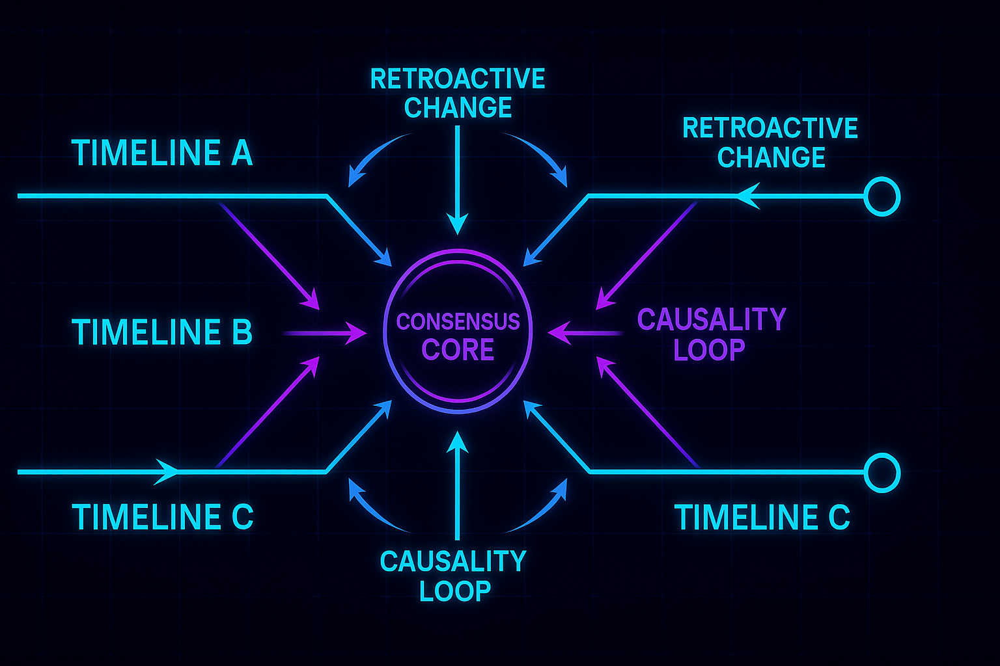

# 🌌 5D Diplomacy: Multiverse Time Travel

_A strategic experiment where timelines, logic, and paradoxes collide._

---

## 🧠 About the Project

**5D Diplomacy** is a reimagined version of the classic strategy game —  
expanded into the **multiverse**, where every move echoes through multiple timelines.

This fork, **Curiosity Edition**, explores:
- distributed time mechanics  
- paradox resolution algorithms  
- and the architecture of self-consistent worlds

> _Can negotiation survive causality loops?_

---

## 🏗 Architecture Overview

The engine models **parallel timelines** as distributed states connected through  
a **consensus layer** that resolves paradoxes between conflicting outcomes.

